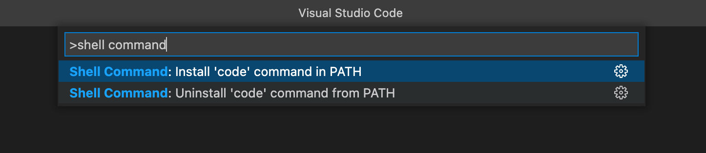

# Mac设置code命令打开VS Code

## 安装
1. 打开VS Code
2. `command + shift + p`
3. 输入`shell command`点击提示`Shell Command: Install 'code' command in PATH`
4. 安装完成后, 即可在命令行中输入`code 文件夹名`, 这样VS Code就会打开该文件夹

[官方文档](https://code.visualstudio.com/docs/setup/mac#_launching-from-the-command-line)
